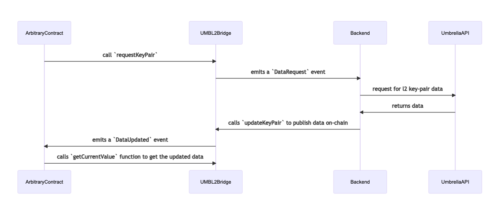

# Umbrella L2 Bridge

## Intro

Umbrella oracles provide two types of data:
1. **First-Class Data(FCD)**: First-class data is key-value pairs that are
   available and committed on-chain. More details [here](https://umbrella-network.readme.io/docs/intro-to-first-class-data-fcd).
2. **Level-2(L2) Data**: Level-2 data are key-value pairs that are relatively
   uncommon and are not committed on-chain. Only the merkle root is published on-chain.
   More details [here](https://umbrella-network.readme.io/docs/intro-to-layer-2-data-l2d).

## Problem

What this means is if a smart contract wants to use an L2 key-pair, it won't be
able to because L2-data is published on-chain.

## Video Demo

[](https://www.youtube.com/watch?v=OFuBVskyln4 "Umbrella L2 Bridge")

## Solution

This project solves this problem by creating a service that monitors for
data requests using the `DataRequest` event emitted by the contract.
Whenever this event is fired, the worker service gets data from the umbrella
L2 chain using the umbrella API, and submit the data along with proofs that
are first validated by the `Chain` contract's `verifyProofForBlock` method.
If the data is valid, the data is published on-chain within the bridge contract
that can be queried for. Another event `DataUpdated` event is also emitted everytime
the data is updated that can be watched for to react to the data availability.

## Flow



## Retrospective

### Limitations

1. Any smart contract requesting data to be published on chain would have to request,
   would have to wait for until the data gets published. This means that the smart
   contract function that required data will have to be retried and executed again
   after the data is published. But this can be made reactive by listening to
   `DataUpdated` events and whenever the update event for the key-pair requested fires,
   one can retrigger the smart contract execution.
2. Needs off-chain bots / workers / services that can listen to the events and publish
   data to the bridge. But this is unavoidable, cost of not publishing the data directly
   on-chain. But the whole concept of L2 data is to have cryptographically verifiable
   data while reducing gas / fee costs by keeping the data off-chain.

### Advantages

1. Anyone can update the data on bridge. The integrity of the data is still guaranteed
   by the merkle proofs that are verified against the given `blockId`s using the
   Umbrella network's `Chain` contract.

## Dev

```bash
yarn install
# start the hardhat local chain
yarn chain
# start frontend
yarn start
# deploy contracts
yarn deploy
# start the worker
yarn worker
```
