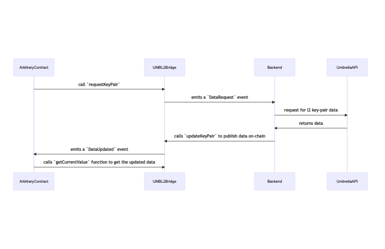

# Umbrella L2 Bridge

## Intro

Umbrella oracles provide two types of data:
1. **First-Class Data(FCD)**: First-class data is key-value pairs that are
   available and committed on-chain. More details [here](https://umbrella-network.readme.io/docs/intro-to-first-class-data-fcd).
2. **Level-2(L2) Data**: Level-2 data are key-value pairs that are relatively
   uncommon and are not committed on-chain. Only the merkle root is published on-chain.
   More details [here](https://umbrella-network.readme.io/docs/intro-to-layer-2-data-l2d).

## Problem

What this means is if a smart contract wants to use an L2 key-pair, it won't be
able to because L2-data is published on-chain.

## Solution

This project tries to solve this problem by allowing smart contracts
to request for an L2-pair to be committed on-chain.

### Flow



## Dev

```bash
yarn install
# start the hardhat local chain
yarn chain
# start frontend
yarn start
# deploy contracts
yarn deploy
```
